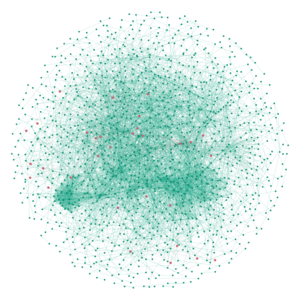

# Data Preprocessing for GraphGR (Graph Reduction)

The details of the data preprocessing for GraphGR is presented as follows.

1. Graph generation

    The network is represented as a node table and an edge table. The node table takes the following format:
    
    |   node_id   |   feature_1   |   feature_2   |   ...   |   feature_m   |
    |:---:|:---:|:---:|:---:|:---:|
    | ENSEMBLID_1 | x1_1 | x1_2 | ... | x1_m |
    | ENSEMBLID_2 | x2_1 | x2_2 | ... | x2_m |
    | ... | ... | ... | ... | ... | ... |
    | ENSEMBLID_n | xn_1 | xn_2 | ... | xn_m |

    Note that we use the ensemble id as the node id for proteins. The node table is the table provided by the user. It contains any features you wish to use for your purpose. For example, in our study, the features contain binding affinity of the drug, gene expression, and disease association score. It is very important that node presented in the node table must be contained in the edge table, which is provided by us in this repo. Otherwise, the network will have an isolated node, where no information propagation occurs regarding such nodes. This makes such nodes useless in the learning process since there is no information exchange with any other nodes.

    The sample edge table is shown as follow:
    
    |   node1_id   |   node2_id   |   feature_1   |
    |:---:|:---:|:---:|
    | ENSEMBLID_1 | ENSEMBLID_2 | conf_1_12 |
    | ENSEMBLID_1 | ENSEMBLID_3 | conf_1_13 |
    | ... | ... | ... |
    | ENSEMBLID_n | ENSEMBLID_k | conf_1_nk |

    The edge table is generated from the STRING database (https://string-db.org/). Version 11 is currently in use. It is established by literature mining. Each interaction has a score, which is the confidence score derived by the authors. The higher the score, more likely the interaction exists in reality.The edge table is preprocessed by removing edges with confidence score below 500 and removing any isolated nodes after the thresholding. The final stats for the graph are,
    - Number of nodes (proteins): 19,144.
    - Number of edges (interactions): 685,198.
    - Average node degree: 72.
    - Density: 0.40%.
    
    The graph generation process will integrate the node table and the edge table to form a graph, which is represented by a `.gexf` file. The file can be read by `Gephi` for visualization purposes and by `Networkx` for calculation purposes. An example (generated by `Gephi`) of the **subgraph** of the original graph in shown below with red node -> kinase, green node -> non-kinase.
    
    

        
    

    
2. Graph reduction

    The graph reduction promotes topological diversity ,feature richness for each graph and lessens the computational cost in the learning stage. Without the reduction, the graph topology is the same for all graphs while the only difference lies in the node features. The reduction procedure relies heavily on the applications of the study since the reduction rules can vary drastically for different applications.
    
    In this work, we employed three reduction rules that address the **protein "kinaseness"** since we focus our work on kinase inhibitors, **gene expressions**, and **gene ontology (biological process) similarity** between proteins. Based on such rules, the reduction is carried out by contracting edges (merging nodes), whose ending nodes (proteins) belong to the same **biological process group** AND have the same **gene expression** AND **neither of them are kinases**. Note that the **biological process group** is precomputed using _GOGO Score_ (https://github.com/zwang-bioinformatics/GOGO) and _Agglomerative Clustering_ (https://scikit-learn.org/stable/modules/generated/sklearn.cluster.AgglomerativeClustering.html).
    
    Following files are required for the reduction procedure:    
    - `master_edge_table.csv` -- ORIGINAL STRING PPI network. Preprocessed as aforementioned yet UNREDUCED. Provided.
    - `node_table.csv` -- The ORIGINAL node table with the format as aforementioned. Contains many features.
    - `bpo_groups.csv` -- Biological process groups for each protein in the graph. Provided.
    - `kinases.lst` -- A list of kinases in the graph. Provided.
    
    The reduction procedure performed in this example can be summarized as following steps.
    
    - Find UNCONTRACTABLE edges according to the aforementioned rules.
    - Remove UNCONTRACABLE edges on a copy of the original network.
    - Find all connected components C = {c_1, c_2, ... , c_l} with more than two nodes in G'. This can be done easily using networkx.
    - Replace all nodes in each connected component with one virtual node v_i, where i = 1,2,3,...,l. Note that some of the node features should be replaced with median/max/mean of the original nodes associated with corresponding virtual node. This should be done in both node table and edge table.
    - Remove redundant nodes, edges in the corresponding tables.
    - Generate new graph from the reduced edge table. 
    
    A flowchart of the procedure is presented in the figure below.
    
    

        
    

    The outputs:
    
    - `reduced_network.gexf` -- A graph representation of the network. Contains all the features (both nodes' and edges').
    - `reduced_node_table.csv` -- One extra feature will be produced to represent the reduction procedure. The kinase nodes will have a value of 2 while the virtual nodes will have a value of 0. And the non-kinase unreduced nodes will have a value of 1.
    - `reduced_edge_table.csv` -- Same format as the original edge table.
    - `reduction_records.csv` -- A record to keep track of every node's final destination in the reduction procedure.

# Prerequisites

1. Python 3.7.*
2. Pandas 1.0 or higher
3. Networkx 2.4 or higher

# Usage
